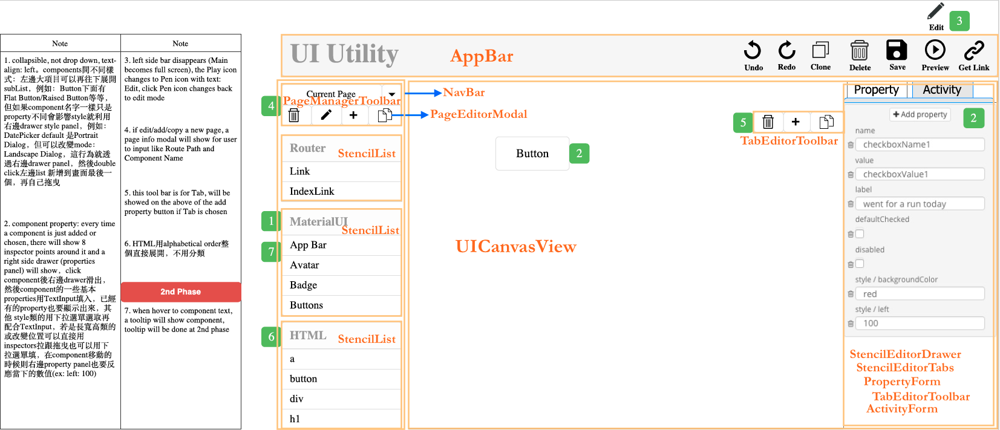
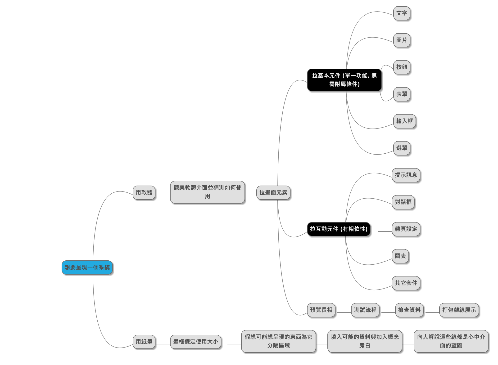
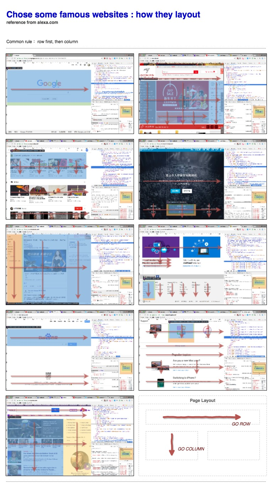

UI UTILITY
==========

## Goal

Similar to [Adobe Dreamweaver](http://www.adobe.com/tw/products/dreamweaver.html), but

* code with [React](https://facebook.github.io/react/)
* bind behavior by user
* cross platform
* web base

## Web App
- :globe_with_meridians: 真實環境  
http://10.120.136.90/ui-utility/

- :bug: 測試環境  
http://10.120.136.90/staging/ui-utility/

## :open_file_folder: Release Folder
http://113.196.174.86:3003/ui-utility/

------------------------------

## :book: Developer guide
http://twtpesir01.delta.corp/react/ui-utility/blob/master/DeveloperGuide.md

## :surfer: State Shape: Reducer
http://twtpesir01.delta.corp/react/ui-utility/blob/master/ReduxReducer.md

------------------------------

## Piwik
http://10.136.225.86:9000/piwik/index.php?module=CoreHome&action=index&idSite=3&period=day&date=yesterday&updated=1#?idSite=3&period=day&date=yesterday&category=Dashboard_Dashboard&subcategory=1

Username: ssir
Password: p@ssw0rd

## Design concept view



_by Mavis_


# Action flow



# Grid system reference




# Folder structure

```
root
│   .babelrc 			// convert js language setting file before you run on browser
│   .eslintrc.js      	// lint js code setting file when you coding
│   .gitignore
│   gulpfile.js       	// build task setting file : gulp CMD when you deploy
│   index.js          	// react app main entry point
│   npm-debug.log     	// install npm package error log for you to solve
│   package.json      	// project description
│   webpack.config.js 	// webpack setting file when you deploy
│
├───example        	               // main entry website
│   │   index.html 	               // main page
│   │
│   └───javascript 	               // production 3-rd library
│           cpmui-pubsub.js
│           material-ui.js
│           mqtt.js
│           react-cpmui-pubsub.js
│           react-dom.js
│           react.js
│
├───node_modules // npm package default folder
│   ├───.bin     // npm linked package CMD
│   └─── ...
│
│
└───src 			// source code
    ├───actions     // action of redux
    ├───components  // your components (view)
    │   ├───appbar  			// component name, all lower-case
    │   │   					// 1) refer to https://github.com/airbnb/javascript/tree/master/react#naming
    │   │   					// 2) refer to SSIR defined code name convention
    │   │
    │   │   	Appbar.js 		// use the same name with folder, Pascal casing
    │   │   	appBarStyles.js // use the same name with folder, but add suffix 'Styles', and end with '.js', Camel Casing
    │   │   					/*
    │   │   	index.js 		refer to https://nodejs.org/api/modules.html rule
    │   │   					refer to https://www.bennadel.com/blog/2169-where-does-node-js-and-require-look-for-modules.htm
    │   │   					use 'index.js' file for module folder entry, and you could import module easily
    │   │   					 */
    │   │
    │   ├───common
    │   │   └───stencil-list
    │   ├───dnd-generator
    │   ├───main-view
    │   ├───navbar
    │   ├───page-editor-modal
    │   ├───page-manager-toolbar
    │   ├───property-form
    │   ├───property-form-row
    │   ├───property-selection-modal
    │   ├───stencil-editor-drawer
    │   ├───stencil-editor-tabs
    │   ├───stencil-inspectors
    │   ├───ui-canvas-view
    │   └───ui-utility-view
    ├───constants
    │   └───propertyType
    ├───containers  // store of redux
    ├───reducers    // reducer of redux
    └───utils 		// common function
```

###### package.json

create a new : `npm init`
```
{
  "name": "ui-utility",
  "version": "0.0.1",
  "description": "Drag and drop utility for creating React UI",
  "main": "./lib/index.js",
  "scripts": {
    "test": "mocha --compilers js:babel-register", // when you try to test code quality
    "build": "gulp transpile",                     // when you convert new js code style to old
    "bundle": "webpack --process --color",         // when you want deploy, combine all js to one
    "lint": "gulp eslint",	                       // when you eslint all file, find error
    "clean": "rm -rf lib/",                        // when you want new build files
    "watch": "webpack --watch --process --color",  // when you want real time build code at coding time
    "dev": "webpack-dev-server --no-info --progress --colors --hot --content-base" // when you want livereload
  },
  "keywords": [
    "javascript",
    "ssir"
  ],
  "author": "SSIR",
  "license": "Delta",
  "devDependencies": {
  	...
  },
  "dependencies": {
    "cpmui-system": "0.0.2",              // private npm, internal use, develop by jerry in Delta
    "ui-utility-code-generator": "0.0.2", // private npm, internal use, develop by mavis in Delta
    "ui-utility-core": "0.0.3",           // private npm, internal use, develop by mavis in Delta
    ...
  }
}
```

###### webpack.config.js

create a new : `webpack init`
```
module.exports = {
  entry: ['webpack/hot/dev-server', './index.js'], // webpack-dev-server CMD, so need extral file
  output: {
    path: './dist',        // build path
    filename: 'app.js',    // build file
    libraryTarget: 'umd',  // as UMD format
    library: 'UIUtility',  // output a library for other use
  },
  module: {
    loaders: [
      {
        test: /\.jsx?$/, // met file
        exclude: /(node_modules|bower_components)/, // these folder not in
        loader: 'babel',                            // need babel to process js
        query: {
          presets: ['es2015', 'react', 'stage-0'],  // use these 3 types in babel
        },
      },
    ],
  },
};

```


# Code base

React + Redux

# Code style

Follow [Airbnb React/JSX Style Guide](https://github.com/airbnb/javascript/tree/master/react)

# Code with CSS framework

[Material-UI](http://www.material-ui.com/#/) : A Set of React Components that Implement Google's Material Design
